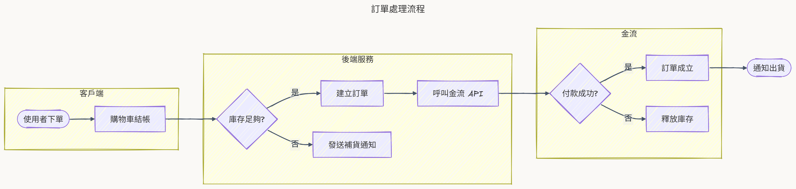

# Super Mermaid

[](https://marketplace.visualstudio.com/items?itemName=mark-ku.super-mermaid)
[](https://marketplace.visualstudio.com/items?itemName=mark-ku.super-mermaid)
[](https://marketplace.visualstudio.com/items?itemName=mark-ku.super-mermaid&ssr=false#review-details)
[](LICENSE)

> **Mermaid diagrams that look good the moment you open them.** No theming, no config — every diagram comes out colored, rounded, and softly shadowed, ready to drop straight into slides, docs, or a PR. It updates live as you type, exports razor-sharp PNG/SVG, and runs **100% offline**.


## Same source, zero config — see the difference

The exact same mermaid code. On the left, the stock theme. On the right, what Super Mermaid shows you by default:

| mermaid default theme | Super Mermaid Colorful (default) | Sketch (hand-drawn) |
| --- | --- | --- |
|  |  |  |

Every image in this README and in **[docs/DEMO.md](docs/DEMO.md)** was exported by the extension itself — not retouched. Browse the gallery to see flowcharts, sequence, ER, class, state, Gantt, pie, mindmap, timeline, and architecture diagrams all get the same treatment.

## Install

1. Open the Extensions view (`Ctrl+Shift+X`), search **"Super Mermaid"**, click **Install** — or [grab it from the Marketplace](https://marketplace.visualstudio.com/items?itemName=mark-ku.super-mermaid).
2. Open any `.md` file with a ```` ```mermaid ```` block, or a `.mmd` / `.mermaid` file.
3. Hit the preview icon at the top-right of the editor. That's it — nothing to configure.

## Why you'll like it

- 🎨 **Looks great out of the box** — Colorful is the default. Flowcharts, sequence, ER, class, state, Gantt, pie, mindmaps, and timelines all get a modern palette with rounded corners and soft shadows, **without changing a single line of mermaid code**. Prefer another look? Switch to Sketch / Auto / Light / Dark / Neutral / Forest from the toolbar.
- ✏️ **Sketch style** — a hand-drawn whiteboard look (mermaid's built-in `handDrawn` renderer) in one click. Applies to exports too.
- ⚡ **Live preview** — refreshes ~0.3s after you type. Mouse-wheel zoom, drag to pan, a Fit button, and a floating `−` / `%` / `+` zoom pill in the corner. On a syntax error the diagram stays at the last good render instead of going blank.
- 🖼️ **Hi-res export & copy** — PNG / JPG / WebP / SVG at 1x / 2x / **4x** (pick 4x for slides — stays crisp when projected), with optional transparent background. **Export All** saves every diagram in the document at once. Press `c` to copy the current diagram to the clipboard and paste straight into Slack, Teams, or PowerPoint.
- 🎯 **Click a node, jump to its code** — clicking any node, subgraph, or actor moves the editor cursor to the line that defines it.
- 🔍 **Find in diagram** — press `/` (or `Ctrl+F`): everything else dims, matches stay lit, `Enter` cycles through them and the view centers on each.
- 📽️ **Presentation mode** — press `p` for a full-screen slideshow of every diagram in the document. Arrow keys to switch, `Esc` to leave. Perfect for walking through architecture in a meeting.
- 🗂️ **Gallery view** — see every diagram in the document on one page; click a thumbnail to open it.
- 🔗 **Share to mermaid.live** — one click builds a link that opens the diagram in the mermaid.live editor. The code lives only in the URL fragment — nothing is uploaded until someone opens the link.
- 🪟 **Pop out** — open the preview in its own floating window via the **Open in New Window** CodeLens above each diagram (or set `superMermaid.previewLocation` to `newWindow`), so you can park it on a second monitor while you keep editing.
- 📝 **Both sources, plus the built-in preview** — works with ```` ```mermaid ```` blocks in Markdown, standalone `.mmd` / `.mermaid` files, **and** the built-in Markdown preview (`Ctrl+Shift+V`) renders mermaid blocks with the same auto coloring.
- 🧠 **Editor smarts** — mermaid syntax highlighting, `%%` comment toggle with `Ctrl+/`, keyword completion, and red squiggles on syntax errors while the preview is open.
- 📚 **Template library** — the `Super Mermaid: Insert Diagram Template` command offers 21 ready-made templates, plus `mmd-*` snippets.
- 🌐 **Every diagram type, fully offline** — flowchart, sequenceDiagram, erDiagram, classDiagram, gantt, pie, mindmap, timeline, journey, C4, architecture… The mermaid engine is bundled inside the extension, so there's no network call and **your code never leaves your machine**.

## How to use

### Open the preview

1. Open any `.md` file with a ```` ```mermaid ```` block, or a `.mmd` / `.mermaid` file.
2. Any of these works:
   - Click the preview icon at the top right of the editor
   - Right-click in the editor → **Super Mermaid: Open Preview to the Side**
   - Right-click a `.md` / `.mmd` file in the Explorer → same command
   - Command Palette (`Ctrl+Shift+P`) → **Super Mermaid: Open Preview to the Side**
3. Then just edit and watch — it refreshes about every 0.3s. On a syntax error a red message pops up and the diagram stays at the last successful render instead of going blank.

### Toolbar (left to right)

| Control | What it does |
| --- | --- |
| Diagram dropdown | Switch between diagrams when one markdown file has several (also follows your cursor in the editor) |
| ▶ | Presentation mode: full-screen slideshow — click / arrow keys to switch, `Esc` or the ✕ button to leave |
| ◎ | Fit: fit the whole diagram into the window (double-clicking the canvas does the same) |
| 🔍 | Find in diagram: type to dim everything except matches, `Enter` cycles through them |
| Theme dropdown | Colorful (default) / Sketch / Auto / Light / Dark / Neutral / Forest — remembers your choice |
| 🔗 | Share to mermaid.live: opens or copies a link with the diagram encoded in the URL |
| ⬇ Export menu | Copy as image, Export SVG / PNG / JPG / WebP, Export all (whole document at once), resolution 1x/2x/4x, transparent background |
| ⋯ More | Gallery (thumbnail overview of all diagrams), Lock to current file, Re-render, Fit Width |

Zoom sits in a floating `−` / `%` / `+` pill in the bottom-right corner of the canvas — click the `%` to jump back to 100%. When the preview is popped out to its own window, a ✕ in the top-right corner (or `Esc`) brings it back and hands focus back to the editor.

### Keyboard shortcuts (when the preview panel has focus)

| Key | Action |
| --- | --- |
| Wheel / drag | Zoom / pan |
| `+` / `=` | Zoom in |
| `-` | Zoom out |
| `0` or double-click | Fit (whole diagram into the window) |
| `1` | Actual size (100%) |
| `w` | Fit Width |
| `g` | Gallery (press again to go back to single view) |
| `c` | Copy the current diagram to the clipboard as a PNG |
| `/` or `Ctrl+F` | Find in diagram (`Enter` next, `Shift+Enter` previous, `Esc` close) |
| `p` | Presentation mode (`←` `→` / `Space` / `PgUp` `PgDn` to switch, `Esc` to leave) |
| Click a node | Jump the editor to the line that defines it |

### Export tips

- Export and copy resolution is controlled by the 1x / 2x / 4x setting in the Export menu; the default is 2x — use 4x for slides.
- The background color follows the current theme; diagrams containing HTML tags (like journey) can't be rasterized, so they're automatically saved as SVG instead.

---

**Enjoying it?** A ⭐ on [GitHub](https://github.com/markku636/vs-code-extension-super-mermaid) and a [rating on the Marketplace](https://marketplace.visualstudio.com/items?itemName=mark-ku.super-mermaid&ssr=false#review-details) genuinely help others find it.

Source code, issue tracker, and development docs: [GitHub Repository](https://github.com/markku636/vs-code-extension-super-mermaid)

Author's blog: [Mark Ku's Blog](https://blog.markkulab.net/)
