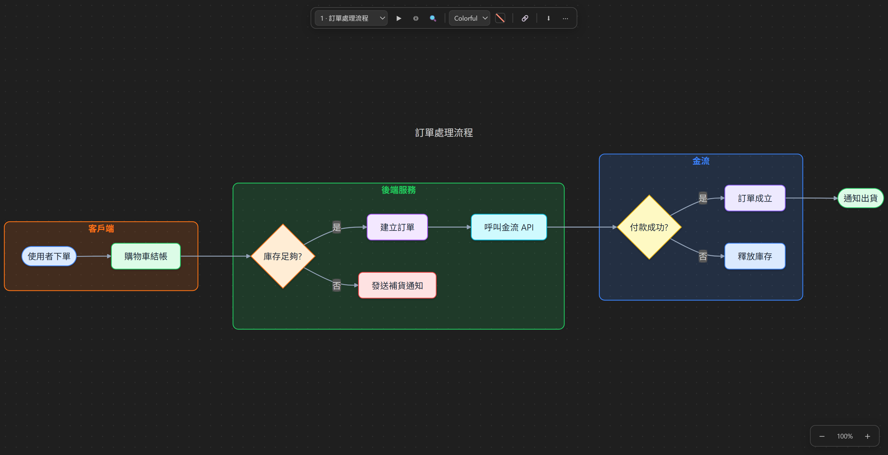
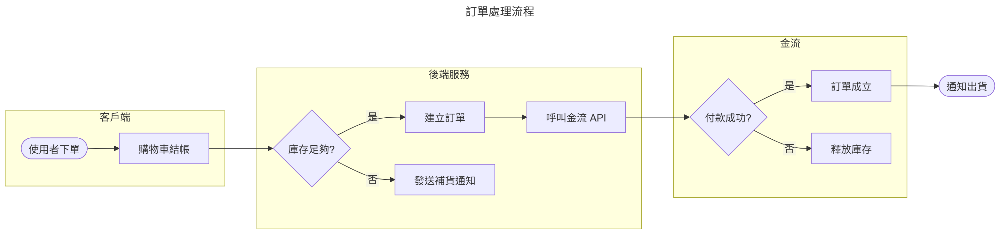
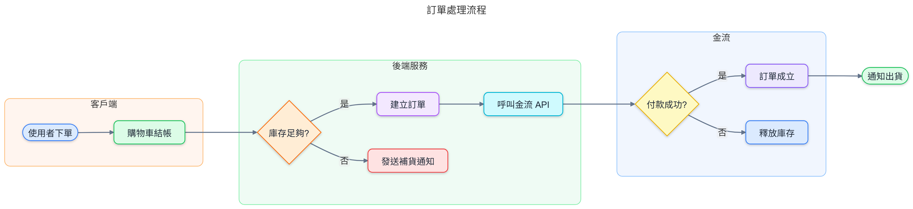

# Super Mermaid

> A Mermaid preview extension for VS Code. Diagrams get colored automatically — zero setup, ready to paste into slides. Live updates as you type, and PNG export up to 4x resolution.



## Features

- **Auto coloring**: Colorful is the default theme — flowcharts, sequence diagrams, ER diagrams, Gantt charts, pie charts, mindmaps, and timelines all get a modern palette with rounded corners and soft shadows, without changing a single line of mermaid code. Not your style? The toolbar can switch back to Auto / Light / Dark / Neutral / Forest
- **Live preview**: updates about 0.3s after you type; mouse-wheel zoom, drag to pan, with Fit / Fit Width / 100% right on the toolbar
- **Export**: PNG / JPG / WebP / SVG at 1x / 2x / 4x resolution (pick 4x for slides — stays sharp when projected), transparent background supported, and Export All saves every diagram in the document at once
- **Both sources work**: ```` ```mermaid ```` blocks inside Markdown, or standalone `.mmd` / `.mermaid` files
- **Works in the built-in Markdown preview too**: the standard preview (`Ctrl+Shift+V`) renders mermaid blocks as diagrams with the same auto coloring
- **Editor language features**: mermaid syntax highlighting, `%%` comment toggle with Ctrl+/, keyword completion, and syntax errors get red squiggles while the preview is open
- **Template library**: the `Super Mermaid: Insert Diagram Template` command offers 21 diagram templates, plus `mmd-*` snippets
- **Gallery view**: see every diagram in the document on one page, click a thumbnail to open it
- **All mermaid diagram types supported**: flowchart, sequenceDiagram, erDiagram, classDiagram, gantt, pie, mindmap, timeline, journey, C4, architecture…
- **Fully offline**: the mermaid engine is bundled inside the extension — no network connection needed, and your code never leaves your machine

Same mermaid source, zero configuration — this is the difference:

| mermaid default theme | Super Mermaid Colorful (default) |
| --- | --- |
|  |  |

See [docs/DEMO.md](docs/DEMO.md) for what the other diagram types look like.

## How to use

### Open the preview

1. Open any `.md` file with a ```` ```mermaid ```` block, or a `.mmd` / `.mermaid` file
2. Any of these works:
   - Click the preview icon at the top right of the editor
   - Right-click in the editor → **Super Mermaid: Open Preview to the Side**
   - Right-click a `.md` / `.mmd` file in the Explorer → same command
   - Command Palette (`Ctrl+Shift+P`) → **Super Mermaid: Open Preview to the Side**
3. Then just edit and watch — it refreshes about every 0.3s. On a syntax error a red message pops up and the diagram stays at the last successful render instead of going blank

### Toolbar (left to right)

| Control | What it does |
| --- | --- |
| Diagram dropdown | Switch between diagrams when one markdown file has several (also follows your cursor in the editor) |
| `−` / `%` / `+` | Zoom out, current zoom level (click to reset to 100%), zoom in |
| ⛶ | Fit: fit the whole diagram into the window (double-clicking the canvas does the same) |
| ↔ | Fit Width: fill the width — use this for wide flowcharts |
| ▦ | Gallery: thumbnail overview of all diagrams, click a card to open it |
| Theme dropdown | Colorful (default) / Auto / Light / Dark / Neutral / Forest — remembers your choice |
| ⬇ Export menu | Export SVG / PNG / JPG / WebP, Export all (whole document at once), resolution 1x/2x/4x, transparent background |
| ⋯ More menu | Lock to the current file, re-render, maximize panel, open in a new window |

### Keyboard shortcuts (when the preview panel has focus)

| Key | Action |
| --- | --- |
| Wheel / drag | Zoom / pan |
| `+` / `=` | Zoom in |
| `-` | Zoom out |
| `0` or double-click | Fit (whole diagram into the window) |
| `1` | Actual size (100%) |
| `w` | Fit Width |
| `g` | Gallery (press again to go back to single view) |
| `f` | Maximize / restore the panel |

### Export tips

- Export and copy resolution is controlled by the 1x / 2x / 4x setting on the toolbar; the default is 2x — use 4x for slides
- The background color follows the current theme; diagrams containing HTML tags (like journey) can't be rasterized, so they're automatically saved as SVG instead

---

Source code, issue tracker, and development docs: [GitHub Repository](https://github.com/markku636/vs-code-extension-super-mermaid)
