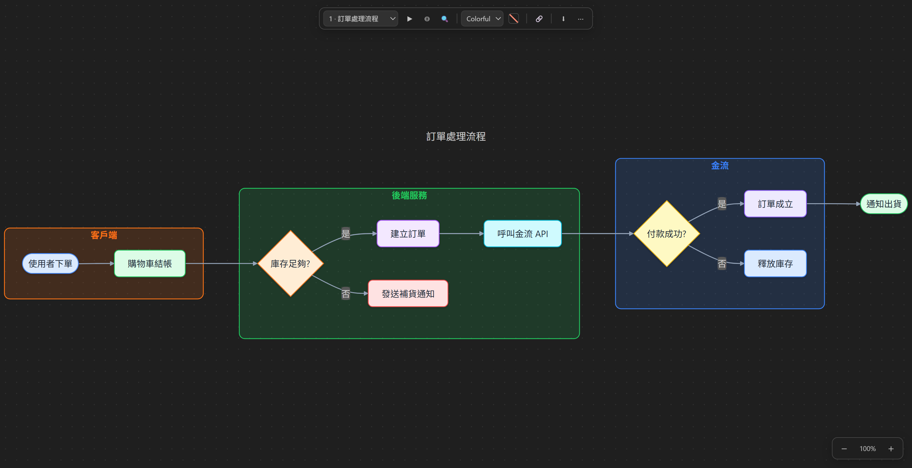
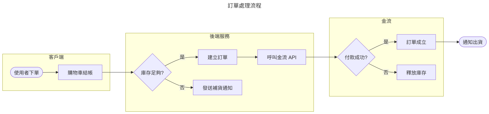
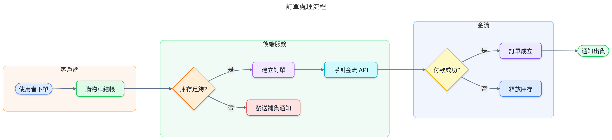
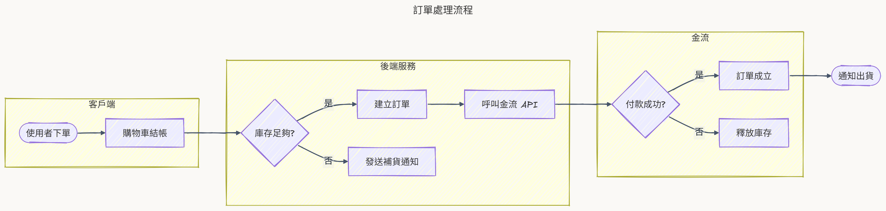
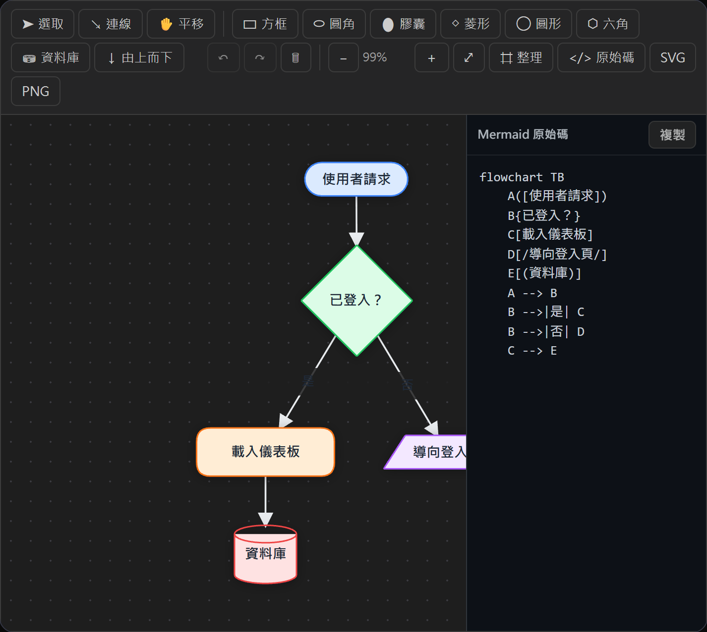
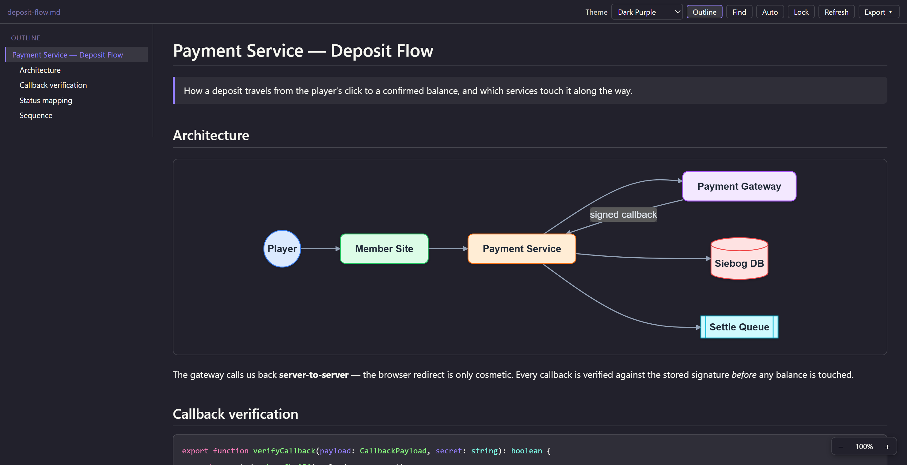

# Super Mermaid

[](https://marketplace.visualstudio.com/items?itemName=mark-ku.super-mermaid)
[](https://marketplace.visualstudio.com/items?itemName=mark-ku.super-mermaid)
[](https://marketplace.visualstudio.com/items?itemName=mark-ku.super-mermaid&ssr=false#review-details)
[](LICENSE)

> **Mermaid diagrams that look good the moment you open them.** No theming, no config — every diagram comes out colored, rounded, and softly shadowed, ready to drop straight into slides, docs, or a PR. It updates live as you type, exports razor-sharp PNG/SVG, and runs **100% offline**.



## Same source, zero config — see the difference

The exact same mermaid code. On the left, the stock theme. On the right, what Super Mermaid shows you by default:

| mermaid default theme | Super Mermaid Colorful (default) | Sketch (hand-drawn) |
| --- | --- | --- |
|  |  |  |

Every image in this README and in **[docs/DEMO.md](docs/DEMO.md)** was exported by the extension itself — not retouched. Browse the gallery to see flowcharts, sequence, ER, class, state, Gantt, pie, mindmap, timeline, and architecture diagrams all get the same treatment.

## ✏️ New: draw diagrams visually → get Mermaid

Don't want to hand-write Mermaid? Click the **✏ Draw** CodeLens above a ```` ```mermaid ```` block (or run **Super Mermaid: Draw Diagram**) to open an **Excalidraw-style visual editor** — now covering **thirteen diagram types**:

| | |
| --- | --- |
| **Node & edge** | flowchart · state · class · ER · mindmap · **requirement** · **C4** (Context / Container / Component) · **sankey** |
| **Time-ordered** | sequence |
| **Lanes & cards** | **kanban** · **user journey** |
| **Positional** | **quadrant chart** |
| **Form** | timeline |

The toolbar offers **only the shapes the diagram type can actually serialize** — a class diagram gets 「類別」, a state diagram gets 狀態 / 起始 / 結束 / 選擇 / 分岔, a C4 diagram gets 人員 / 系統 / 資料庫 / 佇列. Drag to place shapes, drag from a node edge to connect (or to empty space to spawn a connected node), double-click to rename or edit cell content (ER attributes, class members, sequence messages, requirement fields), right-click for shape / colour / align / group / type-specific actions, build sequences from scratch, **reconnect edges**, toggle direction, auto-tidy, **edit the Mermaid source two-way** (套用 / Ctrl+Enter re-renders), **copy the diagram to the clipboard as an image**, and export SVG/PNG.

Several of the newer types make dragging *mean* something rather than just tidying the layout:

- **kanban / user journey** — drag a card into another column to change its status or stage; drag up and down to reorder. Which column a card is in is read from where it sits, so what you see is exactly what gets written.
- **quadrant chart** — a point's position *is* its value: drag it and `[0.30, 0.60]` follows.
- **sankey** — every link's width is its flow; double-click a link to type a new number.

Start from a **template** on the empty canvas (all thirteen types are one click away) and press **`?`** for the keyboard-shortcut overlay. The editor's colours match the live preview exactly — including `classDef`/`style`/`linkStyle` colours, generics, abstract/static members, ER crow's-foot and markdown labels — and everything writes straight back to your file as clean Mermaid (round-trip stable). The remaining data charts (pie / gantt / xychart / gitGraph / block / packet / architecture) still open read-only — use the live preview for those.



## 📄 New: right-click → preview the whole Markdown document

Right-click any `.md` file (in the editor or the Explorer) → **Open Markdown Preview to the Side** — and the **entire document** renders as one scrollable page: headings, tables, highlighted code, and every ```` ```mermaid ```` block auto-colored. Pick **Open Markdown Preview in New Window** instead to pop it onto a second monitor. Scroll sync, a clickable **Outline**, **find in document** (`Ctrl+F` — highlights reach even the text inside diagrams), reading themes, zoom, three content-width modes, and **PNG / PDF export** are all built in.



## Install

1. Open the Extensions view (`Ctrl+Shift+X`), search **"Super Mermaid"**, click **Install** — or [grab it from the Marketplace](https://marketplace.visualstudio.com/items?itemName=mark-ku.super-mermaid).
2. Open any `.md` file with a ```` ```mermaid ```` block, or a `.mmd` / `.mermaid` file.
3. Hit the preview icon at the top-right of the editor. That's it — nothing to configure.

## Why you'll like it

- 🎨 **Looks great out of the box** — Colorful is the default. Flowcharts, sequence, ER, class, state, Gantt, pie, mindmaps, and timelines all get a modern palette with rounded corners and soft shadows — and every subgraph / swimlane gets its own distinct tint and a colored title, so adjacent lanes are easy to tell apart — **without changing a single line of mermaid code**. Pie / Gantt / mindmap / timeline charts are repainted with a **vibrant, high-contrast palette** (white slice separators, contrast-aware labels) instead of mermaid's dim defaults, and **labels are weight-boosted in every theme** so text stays crisp even in thumbnails. Prefer another look? Switch to Sketch / Auto / Light / Dark / Neutral / Forest from the toolbar.
- ✏️ **Sketch style** — a hand-drawn, Excalidraw-like whiteboard look in one click: mermaid's built-in `handDrawn` shapes paired with the bundled **Excalifont** handwriting font (SIL Open Font License 1.1). The font is embedded into PNG / SVG exports too, so the handwriting survives wherever the image goes.
- 🖱️ **Draw it, don't type it** — the **✏ Draw** CodeLens opens an Excalidraw-style visual editor: drag nodes, hover-to-connect (or drag to empty space to spawn a connected node), double-click to rename, right-click to recolor / change shape / align / group into subgraphs. It writes clean Mermaid back to your file, and existing flowcharts open as draggable diagrams.
- ⚡ **Live preview** — refreshes ~0.3s after you type. Mouse-wheel zoom, drag to pan, a Fit button, and a floating `−` / `%` / `+` zoom pill in the corner. On a syntax error the diagram stays at the last good render instead of going blank.
- 🖼️ **Hi-res export & copy** — PNG / JPG / WebP / SVG at 1x / 2x / **4x** (pick 4x for slides — stays crisp when projected), with an optional transparent background or a solid canvas-background color. **Export All** saves every diagram in the document at once. Press `c` to copy the current diagram to the clipboard and paste straight into Slack, Teams, or PowerPoint.
- 🎯 **Click a node, jump to its code** — clicking any node, subgraph, or actor moves the editor cursor to the line that defines it.
- 💬 **Hover a node, see what it is** — resting the mouse on a node in the preview shows a theme-aware tooltip with the node's **full label** (rescues long labels squeezed by fitted diagrams), its id, the source line, and a click-to-open hint. Write `%% @tip NodeId your note` comments in the diagram (indented `%%` lines continue the note; quote the target to match by label) and the note appears in the tooltip too — same syntax as the react-super-mermaid library, so diagrams carry their tips everywhere. In the **editor**, hovering a node id pops a hover hint with the node's label, shape, how many statements connect it, and any `%% @tip` / `%% @check` notes — the diagram's annotations are readable without even opening the preview.
- 🔍 **Find in diagram** — press `/` (or `Ctrl+F`): everything else dims, matches stay lit, `Enter` cycles through them and the view centers on each.
- 📽️ **Presentation mode** — press `p` for a full-screen slideshow of every diagram in the document. Arrow keys to switch, `Esc` to leave. Perfect for walking through architecture in a meeting.
- 🗂️ **Gallery view** — see every diagram in the document on one page; click a thumbnail to open it.
- 🔗 **Share as a link** — one click builds a link that opens the diagram in the [Super Mermaid live preview](https://blog.markkulab.net/tools/mermaid-preview), where the recipient can view, edit and export it. The code lives only in the URL fragment — nothing is uploaded, ever. The format is mermaid.live-compatible, so the same link opens there too.
- 🪟 **Pop out** — open the preview in its own floating window via the **Open in New Window** CodeLens above each diagram (or set `superMermaid.previewLocation` to `newWindow`), so you can park it on a second monitor while you keep editing.
- 📝 **Both sources, plus the built-in preview** — works with ```` ```mermaid ```` blocks in Markdown, standalone `.mmd` / `.mermaid` files, **and** the built-in Markdown preview (`Ctrl+Shift+V`) renders mermaid blocks with the same auto coloring.
- 📄 **Full Markdown document preview** — beyond just the diagrams, render the **whole `.md` file** (headings, text, tables **and** auto-colored Mermaid) in a dedicated Super Mermaid preview. Right-click → **Open Markdown Preview to the Side** to split it beside the editor, or **Open Markdown Preview in New Window** to pop it onto a second monitor. It updates live as you type and follows your editor theme. **Find in document** with `Ctrl+F` (the highlights reach even the label text inside diagrams), cycle the **content width** (Auto / Full / Reading) when wide tables need room, and use the toolbar **Export** button to save the rendered document as a **PNG** image or a multi-page **PDF**. Exports are laid out for paper, not screenshotted: a white **Paper** page with high-contrast text and light diagrams (switch to **Match preview theme** in the Export menu for the dark look), captured at 3x so text stays sharp, with long code lines and wide tables wrapped into the page and PDF page breaks landing between lines instead of through them.
- 🧠 **Editor smarts** — mermaid syntax highlighting, `%%` comment toggle with `Ctrl+/`, keyword completion, hover hints on node ids (label, shape, connections, `%% @tip` / `%% @check` notes), and red squiggles on syntax errors while the preview is open.
- 📚 **Template library** — the `Super Mermaid: Insert Diagram Template` command offers 21 ready-made templates, plus `mmd-*` snippets.
- 🌐 **Every diagram type, fully offline** — flowchart, sequenceDiagram, erDiagram, classDiagram, gantt, pie, mindmap, timeline, journey, C4, architecture… The mermaid engine is bundled inside the extension, so rendering makes **no network call** and your code stays on your machine — the one exception being the share link above, which you build and send yourself.

## How to use

### Open the preview

1. Open any `.md` file with a ```` ```mermaid ```` block, or a `.mmd` / `.mermaid` file.
2. Any of these works:
   - Click the preview icon at the top right of the editor
   - Right-click in the editor → **Super Mermaid: Open Preview to the Side**
   - Right-click a `.md` / `.mmd` file in the Explorer → same command
   - Command Palette (`Ctrl+Shift+P`) → **Super Mermaid: Open Preview to the Side**
3. Then just edit and watch — it refreshes about every 0.3s. On a syntax error a red message pops up and the diagram stays at the last successful render instead of going blank.

### Preview the whole Markdown document

The preview above shows just the diagrams. To render the **entire Markdown file** — headings, text, tables **and** auto-colored Mermaid — use either:

- Right-click in the editor (or on a `.md` file in the Explorer) → **Open Markdown Preview to the Side** / **Open Markdown Preview in New Window**
- Command Palette (`Ctrl+Shift+P`) → **Super Mermaid: Open Markdown Preview to the Side** / **… in New Window**

**to the Side** splits it beside the editor (like the built-in Markdown preview); **in New Window** pops it into its own floating window so you can park it on a second monitor. Both update live as you type and follow the editor theme. In the floating window, a ✕ in the top-right corner (or `Esc`) brings it back and hands focus to the editor. Use the **Lock** button in the preview's toolbar to pin it to the current file instead of following the active editor.

The full-document preview is built for reading long docs:

- **Scroll sync** — scroll the editor and the preview follows to the same place, and vice-versa. **Right-click** anything in the preview → **Go to source line** to jump the editor to the line that produced it.
- **Flicker-free live edits** — as you type, unchanged diagrams are reused from cache and the new content is swapped in atomically, so diagrams don't blink on every keystroke.
- **Outline** — click **Outline** in the toolbar (or press `o`) for a clickable table of contents down the side that tracks your position as you scroll.
- **Find in document** — `Ctrl+F` or the toolbar **Find** button: type to see a live match count, `Enter` / `Shift+Enter` steps through matches, `Esc` closes. Highlights reach even the label text **inside mermaid diagrams**, so you can find a node by name.
- **Content width** — the toolbar width button (or `w`) cycles **Auto / Full / Reading**: Auto keeps a comfortable 920px reading column on narrow panels and goes full-width on large ones, Full always uses 100%, Reading always keeps the column — so wide tables aren't cut off and huge monitors aren't wasted.
- **Syntax highlighting** — non-Mermaid code blocks (C#, SQL, JSON, TypeScript…) are highlighted with colors that match your light/dark theme.
- **Zoom** — **`Ctrl` + mouse wheel** zooms the whole document (text and diagrams together); a floating `−` / `%` / `+` pill in the bottom-right shows the level. `Ctrl` `+` / `-` / `0` work too, and clicking the `%` resets to 100%.
- **Reading themes** — a **Theme** dropdown in the toolbar restyles the whole preview (background, text, code highlighting, and diagram colors) independently of your VS Code theme: **Follow VS Code**, **Light** (default), and dark presets **Dark Purple · Dark Green · Dark Pink · Dark Yellow · Dark Red · Dark Black**. Your choice (and zoom level) is remembered across reopen and restart. Chinese/CJK text uses a dedicated reading font so it stays crisp.

### Toolbar (left to right)

| Control | What it does |
| --- | --- |
| Diagram dropdown | Switch between diagrams when one markdown file has several (also follows your cursor in the editor) |
| ▶ | Presentation mode: full-screen slideshow — click / arrow keys to switch, `Esc` or the ✕ button to leave |
| ◎ | Fit: fit the whole diagram into the window (double-clicking the canvas does the same) |
| 🔍 | Find in diagram: type to dim everything except matches, `Enter` cycles through them |
| Theme dropdown | Colorful (default) / Sketch / Auto / Light / Dark / Neutral / Forest — remembers your choice |
| Background swatch | A color well next to the theme dropdown. Opens a menu to pick the canvas **surface** (preset colors or follow-editor) and an independent **pattern** (None / Dots / Grid) — the dot/grid ink adapts to the surface color so it stays visible on any background. Surface + pattern also apply to exports |
| 🔗 | Share link: opens or copies a link with the diagram encoded in the URL (Super Mermaid live preview) |
| ⬇ Export menu | Copy as image, Export SVG / PNG / JPG / WebP, Export all (whole document at once), resolution 1x/2x/4x, transparent background |
| ⋯ More | Gallery (thumbnail overview of all diagrams), Lock to current file, Re-render, Fit Width |

Zoom sits in a floating `−` / `%` / `+` pill in the bottom-right corner of the canvas — click the `%` to jump back to 100%. When the preview is popped out to its own window, a ✕ in the top-right corner (or `Esc`) brings it back and hands focus back to the editor.

### Keyboard shortcuts (when the preview panel has focus)

| Key | Action |
| --- | --- |
| Wheel / drag | Zoom / pan |
| `+` / `=` | Zoom in |
| `-` | Zoom out |
| `0` or double-click | Fit (whole diagram into the window) |
| `1` | Actual size (100%) |
| `w` | Fit Width |
| `g` | Gallery (press again to go back to single view) |
| `c` | Copy the current diagram to the clipboard as a PNG |
| `/` or `Ctrl+F` | Find in diagram (`Enter` next, `Shift+Enter` previous, `Esc` close) |
| `p` | Presentation mode (`←` `→` / `Space` / `PgUp` `PgDn` to switch, `Esc` to leave) |
| Click a node | Jump the editor to the line that defines it |

### Export tips

- Export and copy resolution is controlled by the 1x / 2x / 4x setting in the Export menu; the default is 2x — use 4x for slides.
- By default the exported background follows the editor theme. Click the **Background** swatch next to the theme dropdown to pick a surface color and a dot/grid pattern (both apply to the preview and to exports), or tick **Transparent background** in the Export menu for a see-through PNG / WebP.
- Diagrams containing HTML tags (like journey) can't be rasterized, so they're automatically saved as SVG instead.

---

**Enjoying it?** A ⭐ on [GitHub](https://github.com/markku636/vs-code-extension-super-mermaid) and a [rating on the Marketplace](https://marketplace.visualstudio.com/items?itemName=mark-ku.super-mermaid&ssr=false#review-details) genuinely help others find it.

Source code, issue tracker, and development docs: [GitHub Repository](https://github.com/markku636/vs-code-extension-super-mermaid)

Author's blog: [Mark Ku's Blog](https://blog.markkulab.net/)
