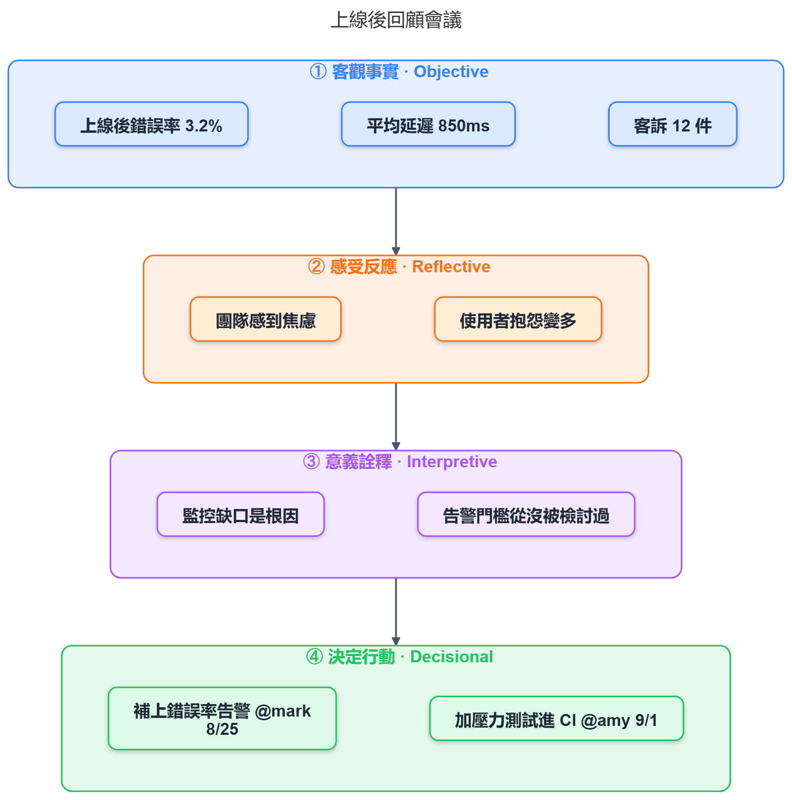

# Super Mermaid

[English](README.md) · **Русский**

[](https://marketplace.visualstudio.com/items?itemName=mark-ku.super-mermaid)
[](https://marketplace.visualstudio.com/items?itemName=mark-ku.super-mermaid)
[](https://marketplace.visualstudio.com/items?itemName=mark-ku.super-mermaid&ssr=false#review-details)
[](LICENSE)

> **Диаграммы Mermaid, которые хорошо выглядят сразу после открытия.** Никаких тем и настроек — каждая диаграмма получается раскрашенной, со скруглёнными углами и мягкой тенью, готовой к вставке в презентацию, документацию или merge request. Предпросмотр обновляется по мере ввода, экспорт даёт предельно резкие PNG и SVG, и всё работает **полностью офлайн**.


## Язык интерфейса

Расширение переведено на русский и на традиционный китайский. Язык интерфейса берётся из настройки **Display Language** самого VS Code: при русском интерфейсе (`ru`) всё будет на русском, при `zh-tw` — на 繁體中文, при любом другом — на английском. Сменить язык VS Code: `Ctrl+Shift+P` → **Configure Display Language**. 繁體中文 — исходный язык проекта, от которого сделан этот форк, поэтому там, где строка была в оригинале, возвращается ровно её формулировка, включая справку по горячим клавишам и контекстное меню, которые рисует сама библиотека. Упрощённого китайского в комплекте нет: VS Code с `zh-cn` получит английский.

Язык можно задать и только для этого расширения, не трогая язык VS Code и не перезапуская его: выпадающий список 🌐 справа на панели инструментов визуального редактора (**Авто / English / Русский / 繁體中文**) или настройка `superMermaid.language`. Изменение применяется сразу — к визуальному редактору, обоим предпросмотрам, подписям CodeLens и строке состояния. Названия команд в палитре и сама страница настроек принадлежат VS Code и по-прежнему следуют его языку интерфейса.

Одно исключение: сниппеты (`mmd-*`). VS Code позволяет объявить только один файл сниппетов, без привязки к языку, поэтому в этой сборке они на русском — и названия, и содержимое вставляемых диаграмм. Команда **Super Mermaid: вставить шаблон диаграммы** этим не ограничена: она идёт через `vscode.l10n` и следует языку редактора.

Кириллица в диаграммах работает в обеих темах, включая набросочную (**Sketch**): встроенный шрифт Excalifont содержит полный кириллический набор, поэтому русский текст не подменяется системным шрифтом и не «разъезжается» — в том числе в экспортированных PNG и SVG, куда шрифт вшивается.

## Тот же исходник, нулевая настройка — сравните

Один и тот же код mermaid. Слева — штатная тема, справа — то, что Super Mermaid показывает по умолчанию:

| Штатная тема mermaid | Super Mermaid Colorful (по умолчанию) | Sketch (от руки) |
| --- | --- | --- |
|  |  |  |

Каждое изображение в этом файле и в **[docs/DEMO.md](docs/DEMO.md)** экспортировано самим расширением, без ретуши. В галерее видно, что одинаковую обработку получают блок-схемы, диаграммы последовательности, ER, классов, состояний, Ганта, круговые, карты мыслей, хронологии и архитектурные схемы.

## ✏️ Рисование диаграмм мышью → готовый Mermaid

Не хочется писать Mermaid руками? Нажмите CodeLens **✏ Нарисовать** над блоком ```` ```mermaid ```` (или выполните команду рисования диаграммы) — откроется **визуальный редактор в стиле Excalidraw**, покрывающий **все двадцать типов диаграмм Mermaid плюс ORID**:

| | |
| --- | --- |
| **Узлы и связи** | flowchart · state · class · ER · mindmap · **requirement** · **C4** (Context / Container / Component) · **architecture** · **sankey** |
| **С временным порядком** | sequence · **gantt** |
| **Дорожки и карточки** | **kanban** · **user journey** |
| **Сетка** | **block** · **packet** |
| **Ветки** | **gitGraph** |
| **Графики** | **quadrant** · **pie** · **xychart** |
| **Форма** | timeline · **ORID** |

Панель инструментов предлагает **только те фигуры, которые данный тип диаграммы способен сериализовать**: для диаграммы классов — «класс», для диаграммы состояний — состояние / начало / конец / выбор / ветвление, для C4 — человек / система / база данных / очередь. Фигуры расставляются перетаскиванием, связь тянется от края узла (а если бросить её на пустое место — создастся связанный узел), двойной щелчок переименовывает или правит содержимое ячейки (атрибуты ER, члены класса, сообщения последовательности, поля требований), правая кнопка даёт фигуру, цвет, выравнивание, группировку и действия, специфичные для типа. Последовательности собираются с нуля, связи **переподключаются**, направление переключается, раскладка упорядочивается автоматически, **исходник Mermaid правится в обе стороны** («Применить» или Ctrl+Enter перерисовывает), **диаграмма копируется в буфер обмена как изображение**, есть экспорт SVG и PNG.

У многих новых типов перетаскивание *что-то означает*, а не просто выравнивает раскладку:

- **kanban / user journey** — перетащите карточку в другой столбец, чтобы сменить статус или этап; вверх-вниз — чтобы изменить порядок. Столбец определяется по фактическому месту карточки, поэтому в файл попадает ровно то, что вы видите.
- **gantt** — x полосы это дата начала, а ширина — длительность: перетащите её, чтобы сдвинуть сроки, потяните за край, чтобы изменить длительность, перенесите в другую полосу, чтобы сменить раздел. Задача, записанная как `after a1`, сохраняет зависимость, пока вы её действительно не перетащите.
- **quadrant** — положение точки *и есть* её значение: перетащите точку, и `[0.30, 0.60]` изменится вслед за ней.
- **xychart** — потяните точку данных вверх, и число вырастет.
- **packet** — ширина поля это число занимаемых бит; номера бит пересчитываются сами.
- **block** — ячейка, в которой стоит блок, определяет его место в исходнике.
- **sankey** — ширина каждой связи это её поток; двойной щелчок по связи позволяет вписать новое число.
- **gitGraph** — родители коммита в исходнике не записаны, они следуют из порядка команд. Поэтому перетащите коммит по горизонтали, чтобы изменить порядок истории, или на другую дорожку, чтобы перенести его в эту ветку; весь поток команд перестраивается по тому, что вы видите.

На пустом полотне можно начать с **шаблона** (все двадцать один тип в один щелчок), а **`?`** показывает подсказку по горячим клавишам. Цвета в редакторе совпадают с живым предпросмотром — включая цвета из `classDef`, `style` и `linkStyle`, дженерики, абстрактные и статические члены, «птичью лапу» в ER и метки с markdown — и всё пишется прямо в ваш файл чистым Mermaid, устойчиво к циклу «прочитать → записать». То, что редактор понимает не полностью — необычный `dateFormat` в gantt, вложенный `block:… end` — передаётся **дословно** и помечается только для чтения, вместо того чтобы быть перезаписанным наполовину.


Горячие клавиши полотна (`Delete`, `?`, `Ctrl+Z` / `Ctrl+Y`, `Ctrl+A` / `Ctrl+D` / `Ctrl+G`, сдвиг стрелками, `V` / `N` / `E`) работают, пока вкладка панели рисования активна: они объявлены обычными сочетаниями VS Code, поэтому их можно переназначить в **Файл → Параметры → Сочетания клавиш** — найдите `superMermaid.editorKey` и отредактируйте `args` нужной строки. `Tab` и `Esc` оставлены самому VS Code и действуют на полотно, когда фокус на нём.


## 🧭 ORID — тип диаграммы, которого в Mermaid нет

Ретроспективы, разборы инцидентов и заметки с воркшопов имеют одну и ту же форму, а диаграммы для неё в Mermaid нет — и каждый раз приходится собирать её вручную из четырёх подграфов с четырьмя правилами раскраски. Super Mermaid добавляет **ORID** (метод *фокусированного обсуждения* ICA) как полноценный тип диаграммы:

```
orid
    title Разбор после релиза
    objective
        Доля ошибок 3,2%
        Задержка p95 850 мс
    reflective
        Команда напряжена
    interpretive
        Корневая причина — пробел в мониторинге
    decisional
        Добавить алерты @mark 25.08
```



Четыре фиксированных этапа — **O**bjective (факты) → **R**eflective (реакции) → **I**nterpretive (смысл) → **D**ecisional (действия) — рисуются вертикальной воронкой: по одной цветной полосе на этап, пункты внутри раскладываются рядами. Порядок всегда канонический O→R→I→D, как бы вы их ни записали, а объявленный, но пустой этап показывает пунктирный placeholder, а не сжимается в полоску.

Это настоящий тип диаграммы, а не сниппет: CodeLens **✏ Изменить** открывает структурированную форму из четырёх этапов (добавление, удаление, изменение порядка пунктов, живой предпросмотр), которая пишет чистый ORID обратно в файл. А поскольку перед отрисовкой он транспилируется в flowchart, **всё остальное на нём уже работает**: обе темы, тёмный режим, панорама и масштаб, поиск по диаграмме, экспорт PNG и SVG, режим презентации, галерея, ссылки для обмена, `%% @tip` и `%% @check` (идентификаторы пунктов — `O1`, `R2`, `I1`, `D3`…).

> Пункт, который сам начинается с ключевого слова этапа, пишите как `- objective — расплывчатое слово`: дефис заставляет его остаться пунктом. Однобуквенные сокращения не поддерживаются намеренно: пункт, начинающийся с `I feel…`, иначе открыл бы этап Interpretive и «съел» остаток блока.

## 📄 Предпросмотр всего документа Markdown

Щёлкните правой кнопкой по любому файлу `.md` (в редакторе или в проводнике) → **Super Mermaid: открыть предпросмотр Markdown сбоку** — и **весь документ** отрисуется одной прокручиваемой страницей: заголовки, таблицы, подсвеченный код и каждый блок ```` ```mermaid ```` с автоматической раскраской. Вариант **в отдельном окне** выносит предпросмотр на второй монитор. Синхронная прокрутка, кликабельное **оглавление**, **поиск по документу** (`Ctrl+F` — подсветка достаёт даже текст внутри диаграмм), темы для чтения, масштаб, три режима ширины содержимого и **экспорт в PNG и PDF** уже встроены.


## Установка

1. Откройте панель расширений (`Ctrl+Shift+X`), найдите **«Super Mermaid»**, нажмите **Install** — либо [возьмите из Marketplace](https://marketplace.visualstudio.com/items?itemName=mark-ku.super-mermaid).
2. Откройте любой файл `.md` с блоком ```` ```mermaid ```` или файл `.mmd` / `.mermaid`.
3. Нажмите значок предпросмотра в правом верхнем углу редактора. Всё — настраивать нечего.

## Чем это удобно

- 🧭 **Диаграммы ORID** — метод фокусированного обсуждения (Objective → Reflective → Interpretive → Decisional) как тип диаграммы, которого в Mermaid нет, со структурированным редактором на четыре этапа. Идеально для ретроспектив и разборов инцидентов; все остальные возможности (темы, экспорт, поиск, подсказки, проверки) работают на нём без изменений.
- 🎨 **Хорошо выглядит сразу** — по умолчанию включена тема Colorful. Блок-схемы, последовательности, ER, классы, состояния, Гант, круговые, карты мыслей и хронологии получают современную палитру со скруглёнными углами и мягкими тенями, а каждый подграф или дорожка — свой оттенок и цветной заголовок, так что соседние дорожки легко различить — **без единой правки в коде mermaid**. Круговые, Ганта, карты мыслей и хронологии перекрашиваются в **насыщенную контрастную палитру** (белые разделители секторов, подписи с учётом контраста) вместо тусклых значений по умолчанию, а **насыщенность шрифта подписей повышается во всех темах**, чтобы текст оставался читаемым даже в миниатюрах. Хочется другого вида? Переключитесь на Sketch / Auto / Light / Dark / Neutral / Forest на панели инструментов.
- ✏️ **Стиль наброска** — вид доски, нарисованной от руки, в стиле Excalidraw, в один щелчок: встроенные в mermaid фигуры `handDrawn` вместе с поставляемым рукописным шрифтом **Excalifont** (лицензия SIL Open Font License 1.1). Шрифт вшивается и в экспортированные PNG и SVG, поэтому рукописный вид сохраняется всюду, куда попадёт изображение. Кириллица в этом шрифте есть — русский текст выглядит так же, как латиница.
- 🖱️ **Нарисовать, а не набрать** — CodeLens **✏ Нарисовать** открывает визуальный редактор в стиле Excalidraw: перетаскивайте узлы, соединяйте наведением (или бросьте связь на пустое место, чтобы создать связанный узел), переименовывайте двойным щелчком, правой кнопкой меняйте цвет и форму, выравнивайте и группируйте в подграфы. Результат пишется в файл чистым Mermaid, а существующие блок-схемы открываются как перетаскиваемые диаграммы.
- ⚡ **Живой предпросмотр** — обновляется примерно через 0,3 с после ввода. Масштаб колесом мыши, панорама перетаскиванием, кнопка «вписать» и плавающая «пилюля» `−` / `%` / `+` в углу. При синтаксической ошибке диаграмма остаётся в последнем удачном состоянии, а не становится пустой.
- 🖼️ **Экспорт и копирование в высоком разрешении** — PNG / JPG / WebP / SVG в 1x / 2x / **4x** (для презентаций берите 4x — останется резким на проекторе), с прозрачным фоном или сплошным цветом полотна. **Экспортировать все** сохраняет сразу все диаграммы документа. Клавиша `c` копирует текущую диаграмму в буфер обмена — вставляется прямо в Slack, Teams или PowerPoint.
- 🎯 **Щёлкните узел — попадёте в его код** — щелчок по узлу, подграфу или действующему лицу переводит курсор редактора на строку с определением.
- 💬 **Наведите на узел — увидите, что это** — при наведении мыши на узел в предпросмотре появляется подсказка в цветах темы: **полная метка** узла (спасает длинные метки, сжатые при вписывании), его идентификатор, строка исходника и намёк «щёлкните, чтобы открыть». Комментарии `%% @tip NodeId ваша заметка` в диаграмме (строки `%%` с отступом продолжают заметку; чтобы сопоставлять по метке, возьмите цель в кавычки) тоже попадают в подсказку — синтаксис тот же, что в библиотеке react-super-mermaid, поэтому диаграммы носят подсказки с собой. В **редакторе** наведение на идентификатор узла показывает метку, форму, число связывающих его выражений и все заметки `%% @tip` и `%% @check` — аннотации диаграммы читаются, даже не открывая предпросмотр.
- 🔍 **Поиск по диаграмме** — нажмите `/` (или `Ctrl+F`): всё остальное затемняется, совпадения остаются подсвеченными, `Enter` перебирает их, а вид центрируется на каждом.
- 📽️ **Режим презентации** — `p` включает полноэкранный показ всех диаграмм документа. Стрелки переключают, `Esc` выходит. Удобно разбирать архитектуру на встрече.
- 🗂️ **Галерея** — все диаграммы документа на одной странице; щелчок по миниатюре открывает нужную.
- 🔗 **Ссылка для обмена** — один щелчок собирает ссылку, которая открывает диаграмму в [живом предпросмотре Super Mermaid](https://blog.markkulab.net/tools/mermaid-preview), где получатель может её посмотреть, изменить и экспортировать. Код живёт только во фрагменте URL — ничего никуда не загружается. Формат совместим с mermaid.live, поэтому та же ссылка открывается и там.
- 🪟 **Отдельное окно** — откройте предпросмотр в собственном плавающем окне через CodeLens **Открыть в отдельном окне** над диаграммой (или задайте `superMermaid.previewLocation` в `newWindow`), чтобы держать его на втором мониторе и продолжать править код.
- 📝 **Оба источника плюс встроенный предпросмотр** — работает с блоками ```` ```mermaid ```` в Markdown, с отдельными файлами `.mmd` / `.mermaid` **и** со встроенным предпросмотром Markdown (`Ctrl+Shift+V`), который отрисовывает блоки mermaid с той же автораскраской.
- 📄 **Предпросмотр всего документа Markdown** — не только диаграммы: **весь файл `.md`** (заголовки, текст, таблицы **и** раскрашенный Mermaid) в отдельном предпросмотре Super Mermaid. Правая кнопка → **открыть предпросмотр Markdown сбоку**, чтобы разделить область с редактором, или **в отдельном окне**, чтобы вынести на второй монитор. Обновляется по мере ввода и следует теме редактора. **Поиск по документу** через `Ctrl+F` (подсветка достаёт и текст меток внутри диаграмм), переключение **ширины содержимого** («Авто» / «Вся ширина» / «Для чтения»), когда широким таблицам нужно место, и кнопка **Экспорт** на панели, чтобы сохранить отрисованный документ как **PNG** или многостраничный **PDF**. Экспорт свёрстан под бумагу, а не снят скриншотом: белая страница **«Бумага»** с контрастным текстом и светлыми диаграммами (в меню экспорта можно переключить на **«Как в предпросмотре»** для тёмного вида), снимок в 3x, чтобы текст оставался резким, длинные строки кода и широкие таблицы переносятся по странице, а разрывы страниц PDF попадают между строк, а не сквозь них.
- 🧠 **Умный редактор** — подсветка синтаксиса mermaid, переключение комментариев `%%` по `Ctrl+/`, автодополнение ключевых слов, подсказки при наведении на идентификаторы узлов (метка, форма, связи, заметки `%% @tip` и `%% @check`) и красные подчёркивания на синтаксических ошибках, пока открыт предпросмотр.
- 📚 **Библиотека шаблонов** — команда **Super Mermaid: вставить шаблон диаграммы** предлагает 23 готовых шаблона, плюс сниппеты `mmd-*`.
- 🌐 **Все типы диаграмм, полностью офлайн** — flowchart, sequenceDiagram, erDiagram, classDiagram, gantt, pie, mindmap, timeline, journey, C4, architecture… Движок mermaid встроен в расширение, поэтому отрисовка **не делает ни одного сетевого запроса**, а ваш код остаётся на вашей машине. Единственное исключение — ссылка для обмена выше, которую вы создаёте и отправляете сами.

## Как пользоваться

### Открыть предпросмотр

1. Откройте любой файл `.md` с блоком ```` ```mermaid ```` или файл `.mmd` / `.mermaid`.
2. Подойдёт любой из способов:
   - щёлкнуть значок предпросмотра в правом верхнем углу редактора;
   - правая кнопка в редакторе → **Super Mermaid: открыть предпросмотр сбоку**;
   - правая кнопка по файлу `.md` / `.mmd` в проводнике → та же команда;
   - палитра команд (`Ctrl+Shift+P`) → **Super Mermaid: открыть предпросмотр сбоку**.
3. Дальше просто правьте и смотрите — обновление примерно каждые 0,3 с. При синтаксической ошибке всплывает красное сообщение, а диаграмма остаётся в последнем удачном состоянии.

### Предпросмотр всего документа Markdown

Предпросмотр выше показывает только диаграммы. Чтобы отрисовать **весь файл Markdown** — заголовки, текст, таблицы **и** раскрашенный Mermaid — используйте:

- правую кнопку в редакторе (или по файлу `.md` в проводнике) → **открыть предпросмотр Markdown сбоку** / **в отдельном окне**;
- палитру команд (`Ctrl+Shift+P`) → **Super Mermaid: открыть предпросмотр Markdown сбоку** / **… в отдельном окне**.

**Сбоку** делит область с редактором (как встроенный предпросмотр Markdown); **в отдельном окне** выносит в плавающее окно, которое можно оставить на втором мониторе. Оба обновляются по мере ввода и следуют теме редактора. В плавающем окне ✕ в правом верхнем углу (или `Esc`) возвращает его обратно и передаёт фокус редактору. Кнопка **Закрепить** на панели предпросмотра привязывает его к текущему файлу вместо слежения за активным редактором.

Предпросмотр всего документа сделан для чтения длинных текстов:

- **Синхронная прокрутка** — прокручиваете редактор, предпросмотр едет за ним, и наоборот. **Правая кнопка** по чему угодно в предпросмотре → **перейти к строке исходника**, чтобы прыгнуть в редакторе на строку-источник.
- **Правки без мерцания** — при вводе неизменившиеся диаграммы берутся из кэша, а новое содержимое подменяется атомарно, поэтому диаграммы не мигают на каждом нажатии.
- **Оглавление** — кнопка **Оглавление** на панели (или клавиша `o`) выводит кликабельное содержание сбоку, которое следит за вашим положением при прокрутке.
- **Поиск по документу** — `Ctrl+F` или кнопка **Найти** на панели: по мере ввода видно число совпадений, `Enter` и `Shift+Enter` перебирают их, `Esc` закрывает. Подсветка достаёт даже текст меток **внутри диаграмм mermaid**, поэтому узел можно найти по имени.
- **Ширина содержимого** — кнопка ширины на панели (или `w`) переключает **«Авто» / «Вся ширина» / «Для чтения»**: «Авто» держит удобную колонку 920px на узких панелях и растягивается на широких, «Вся ширина» всегда занимает 100%, «Для чтения» всегда держит колонку — так широкие таблицы не обрезаются, а большие мониторы не простаивают.
- **Подсветка синтаксиса** — блоки кода не на Mermaid (C#, SQL, JSON, TypeScript…) подсвечиваются цветами, согласованными с вашей светлой или тёмной темой.
- **Масштаб** — **`Ctrl` и колесо мыши** масштабируют весь документ (текст и диаграммы вместе); плавающая «пилюля» `−` / `%` / `+` справа снизу показывает уровень. `Ctrl` `+` / `-` / `0` тоже работают, а щелчок по `%` сбрасывает на 100%.
- **Темы для чтения** — выпадающий список **Тема** на панели меняет оформление всего предпросмотра (фон, текст, подсветку кода и цвета диаграмм) независимо от темы VS Code: **как в VS Code**, **светлая** и тёмные наборы **тёмная фиолетовая · тёмная зелёная · тёмная розовая · тёмная жёлтая · тёмная красная · тёмная чёрная**. Выбор (и уровень масштаба) запоминается между открытиями и перезапусками.

### Панель инструментов (слева направо)

| Элемент | Что делает |
| --- | --- |
| Список диаграмм | Переключение между диаграммами, когда в одном файле Markdown их несколько (также следует за курсором в редакторе) |
| ▶ | Режим презентации: полноэкранный показ — щелчок или стрелки переключают, `Esc` или ✕ выходит |
| ◎ | Вписать диаграмму целиком в окно (двойной щелчок по полотну делает то же) |
| 🔍 | Поиск по диаграмме: ввод затемняет всё, кроме совпадений, `Enter` перебирает их |
| Список тем | Colorful (по умолчанию) / Sketch / Auto / Light / Dark / Neutral / Forest — выбор запоминается |
| Образец фона | Цветовой квадрат рядом со списком тем. Открывает меню выбора **подложки** полотна (готовые цвета или «как в редакторе») и независимого **узора** («Нет» / «Точки» / «Сетка») — цвет точек и линий подстраивается под подложку, чтобы оставаться заметным на любом фоне. Подложка и узор применяются и при экспорте |
| 🔗 | Ссылка для обмена: открывает или копирует ссылку с диаграммой, закодированной в URL (живой предпросмотр Super Mermaid) |
| ⬇ Меню экспорта | Скопировать как изображение, экспорт SVG / PNG / JPG / WebP, экспортировать все (весь документ сразу), разрешение 1x/2x/4x, прозрачный фон |
| ⋯ Ещё | Галерея (обзор миниатюр всех диаграмм), привязать к текущему файлу, перерисовать, по ширине |

Масштаб живёт в плавающей «пилюле» `−` / `%` / `+` в правом нижнем углу полотна — щелчок по `%` возвращает 100%. Если предпросмотр вынесен в отдельное окно, ✕ в правом верхнем углу (или `Esc`) возвращает его назад и передаёт фокус редактору.

### Горячие клавиши (когда фокус на панели предпросмотра)

| Клавиша | Действие |
| --- | --- |
| Колесо / перетаскивание | Масштаб / панорама |
| `+` / `=` | Увеличить |
| `-` | Уменьшить |
| `0` или двойной щелчок | Вписать диаграмму целиком в окно |
| `1` | Реальный размер (100%) |
| `w` | По ширине |
| `g` | Галерея (повторное нажатие возвращает к одиночному виду) |
| `c` | Скопировать текущую диаграмму в буфер обмена как PNG |
| `/` или `Ctrl+F` | Поиск по диаграмме (`Enter` — вперёд, `Shift+Enter` — назад, `Esc` — закрыть) |
| `p` | Режим презентации (`←` `→` / `Space` / `PgUp` `PgDn` переключают, `Esc` выходит) |
| Щелчок по узлу | Перейти в редакторе к строке с его определением |

### Советы по экспорту

- Разрешение экспорта и копирования задаётся переключателем 1x / 2x / 4x в меню экспорта; по умолчанию 2x — для презентаций берите 4x.
- По умолчанию фон при экспорте следует теме редактора. Щёлкните образец **Фон** рядом со списком тем, чтобы выбрать цвет подложки и узор из точек или линий (применяются и к предпросмотру, и к экспорту), либо отметьте **Прозрачный фон** в меню экспорта для PNG или WebP «на просвет».
- Диаграммы с HTML-тегами (например, journey) нельзя растеризовать, поэтому они автоматически сохраняются как SVG.

---

**Понравилось?** ⭐ на [GitHub](https://github.com/markku636/vs-code-extension-super-mermaid) и [оценка в Marketplace](https://marketplace.visualstudio.com/items?itemName=mark-ku.super-mermaid&ssr=false#review-details) действительно помогают другим его найти.

Исходный код, трекер задач и документация разработчика: [репозиторий на GitHub](https://github.com/markku636/vs-code-extension-super-mermaid)

Блог автора: [Mark Ku's Blog](https://blog.markkulab.net/)
