# 圖表效果展示

本頁所有圖片**都是 Super Mermaid 自己匯出的**（Colorful 主題、2x PNG），不是修圖示意——
你裝上擴充套件、打開 [examples/demo.md](../examples/demo.md) 按下 Export 就會得到一模一樣的結果。

- 圖表原始碼：[examples/demo.md](../examples/demo.md)、[examples/architecture.mmd](../examples/architecture.mmd)
- 重新產生本頁圖片：`npm run build && npm run gen:demo-images`（用 headless Chrome 驅動擴充套件真正的匯出管線）

## 預覽面板

開啟 `.md` / `.mmd` 後一鍵開預覽：工具列可切換圖表、縮放、換主題、匯出。

按 `g` 開 Gallery 縮圖牆，整份文件的圖表一頁看完：

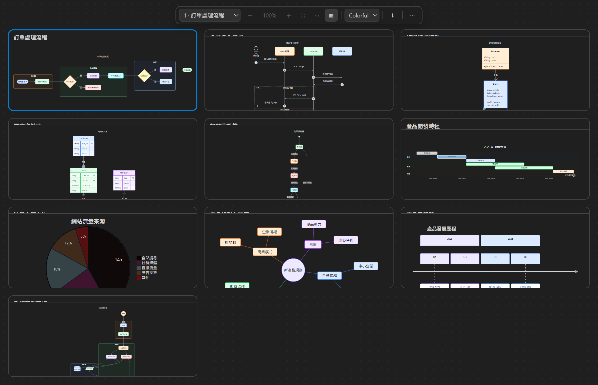

## Colorful 主題：前後對比

同一段 mermaid 程式碼、零設定，左邊是 mermaid 預設主題，右邊是 Super Mermaid 的 Colorful 主題：

| mermaid 預設主題 | Super Mermaid Colorful（預設） |
| --- | --- |
|  |  |

---

## 各圖表類型效果

### 流程圖 Flowchart（含子圖）

子圖各自配色、節點循環現代色票，判斷節點自動套用強調色。

原始碼

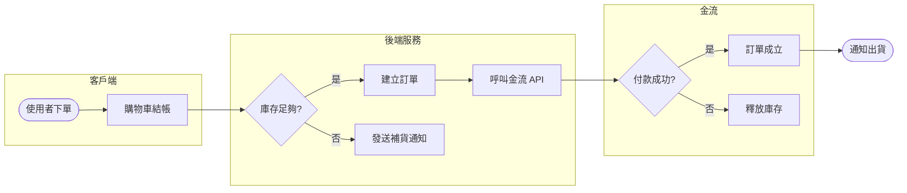

### 循序圖 Sequence

每個參與者一個顏色，alt / autonumber 完整支援。

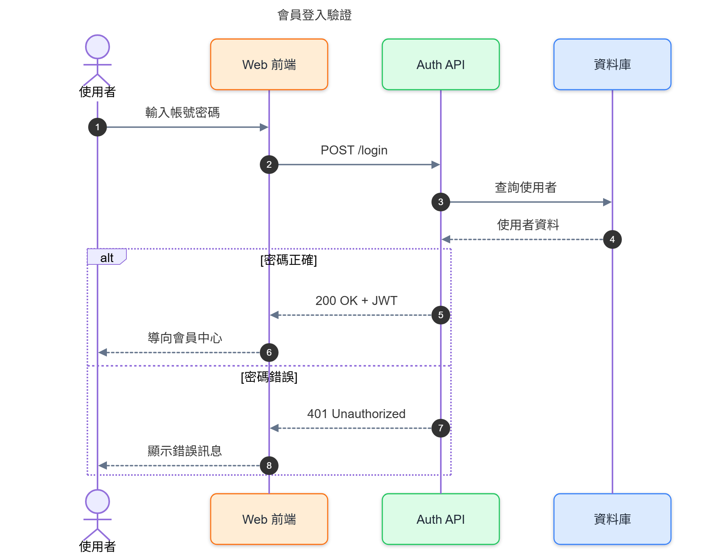

### 類別圖 Class

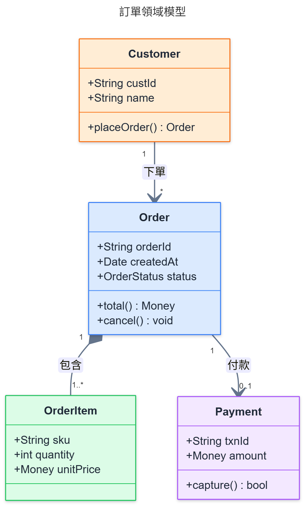

### 實體關聯圖 ER

每張表一個色系，欄位列交錯上色。

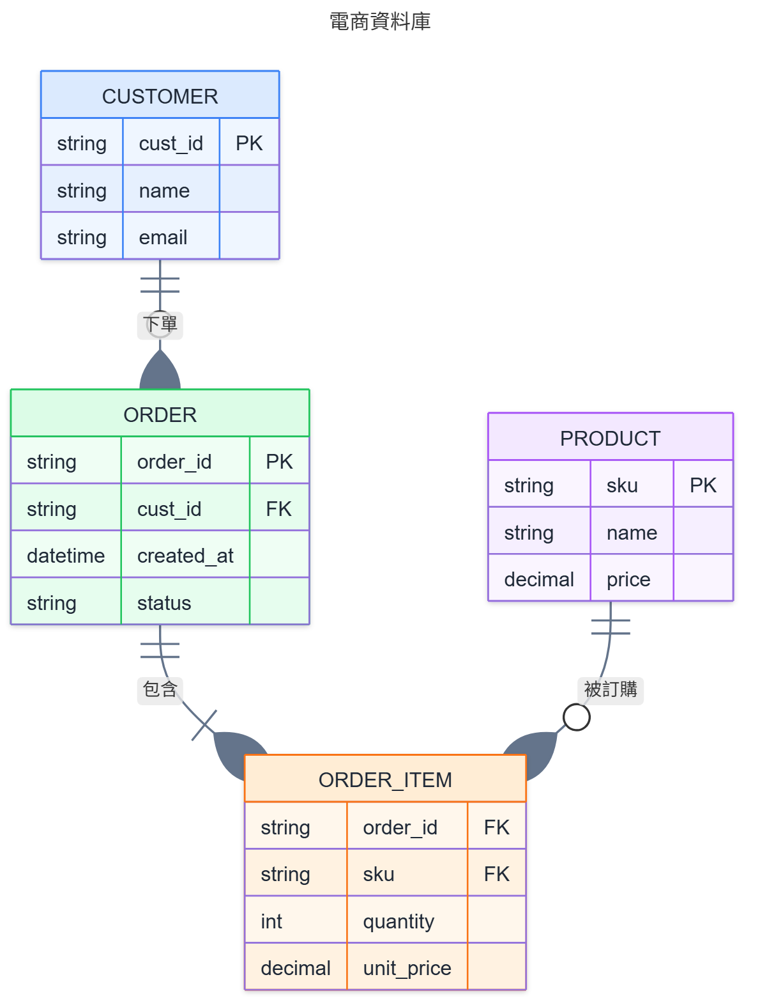

### 狀態圖 State

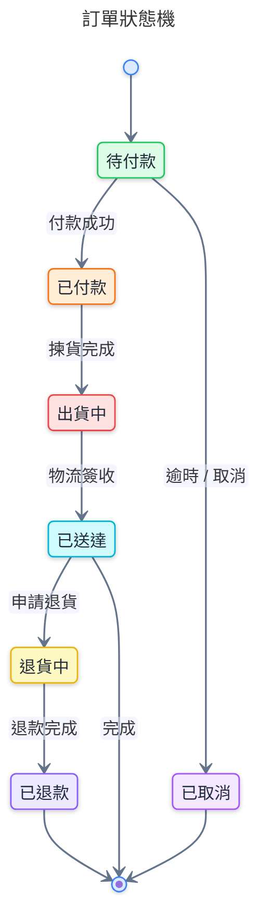

### 甘特圖 Gantt

不同 section 的任務自動換色，`done` / `active` / `milestone` 樣式照常生效。

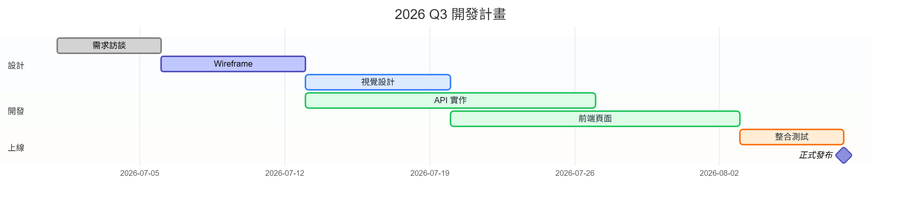

### 圓餅圖 Pie

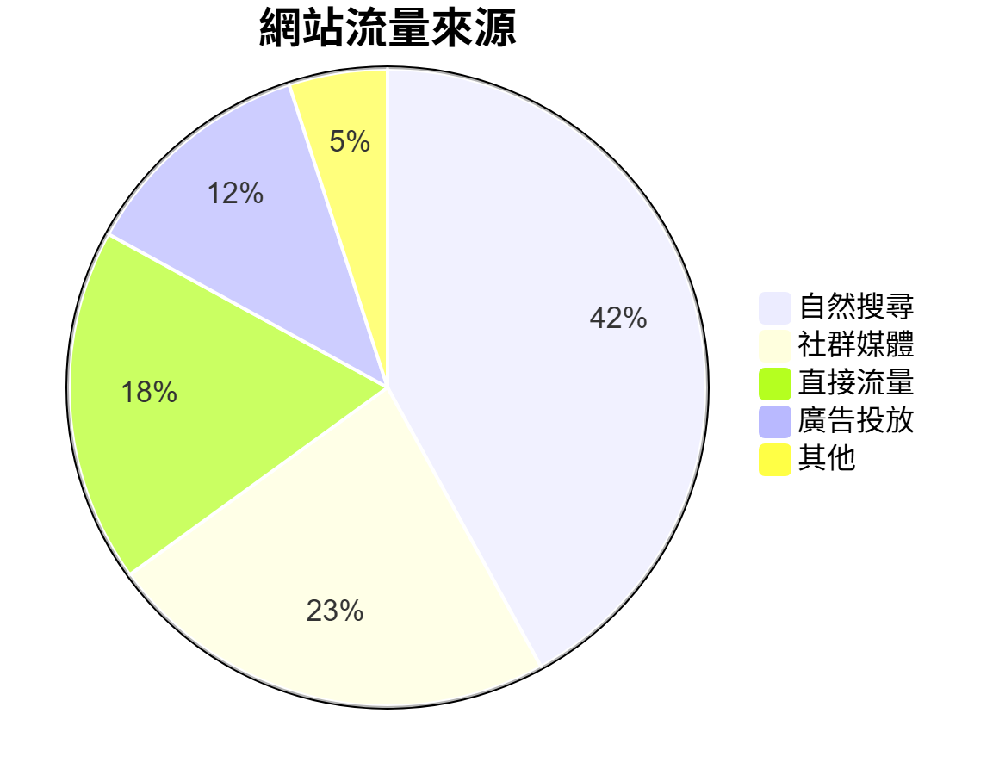

### 心智圖 Mindmap

每個分支一個色系，往外淡化。

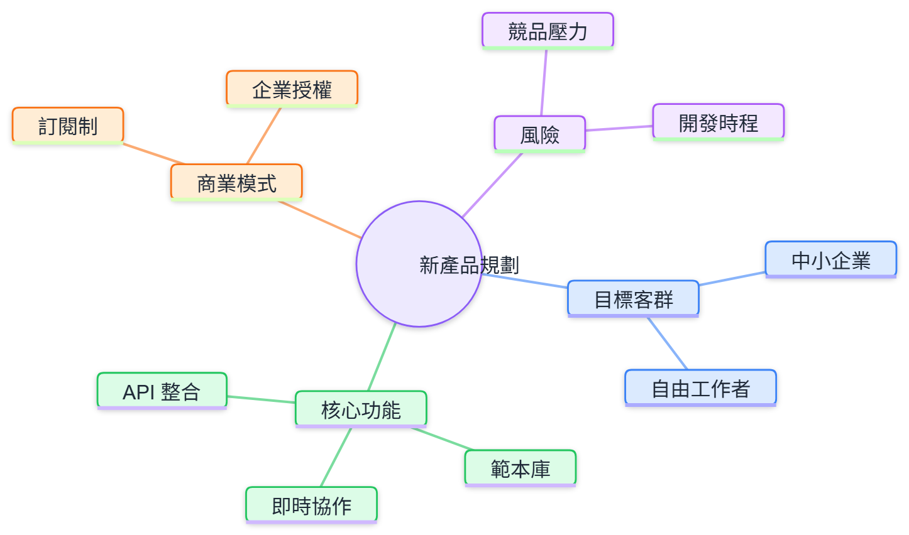

### 時間軸 Timeline

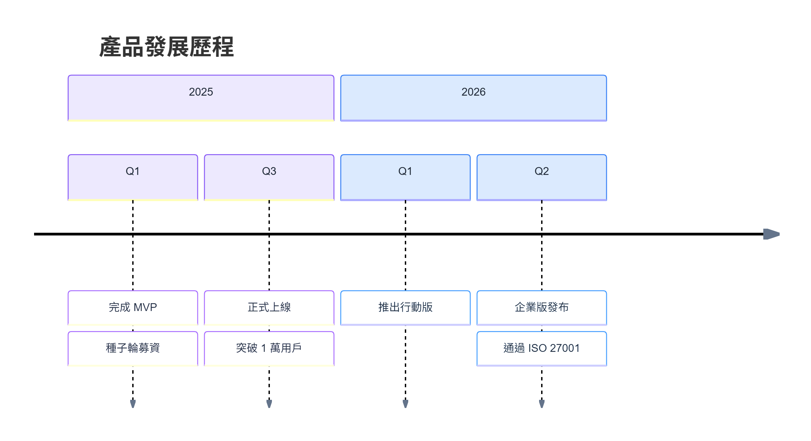

### 架構圖（獨立 .mmd 檔）

獨立的 `.mmd` / `.mermaid` 檔同樣支援——這張來自 [examples/architecture.mmd](../examples/architecture.mmd)。

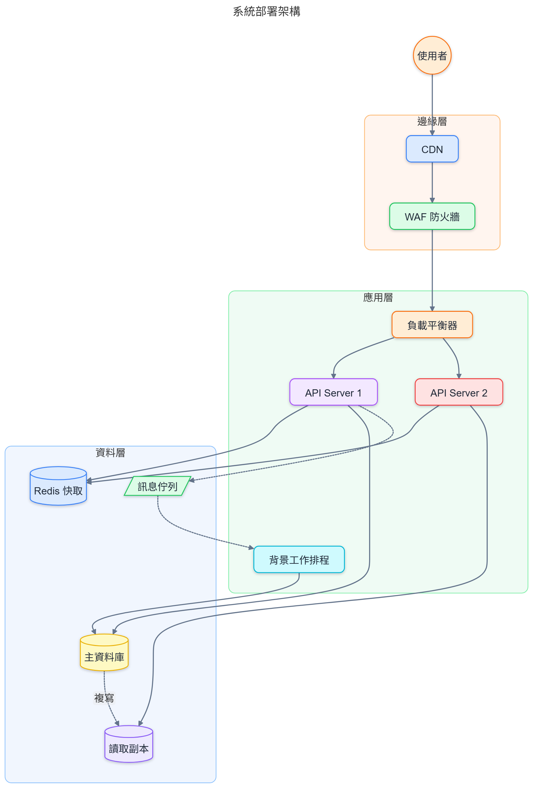
