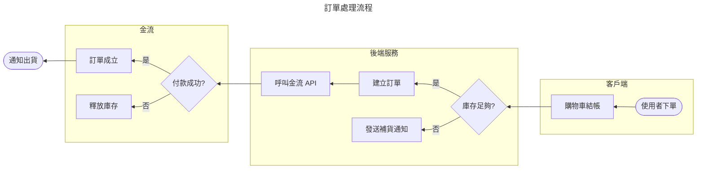
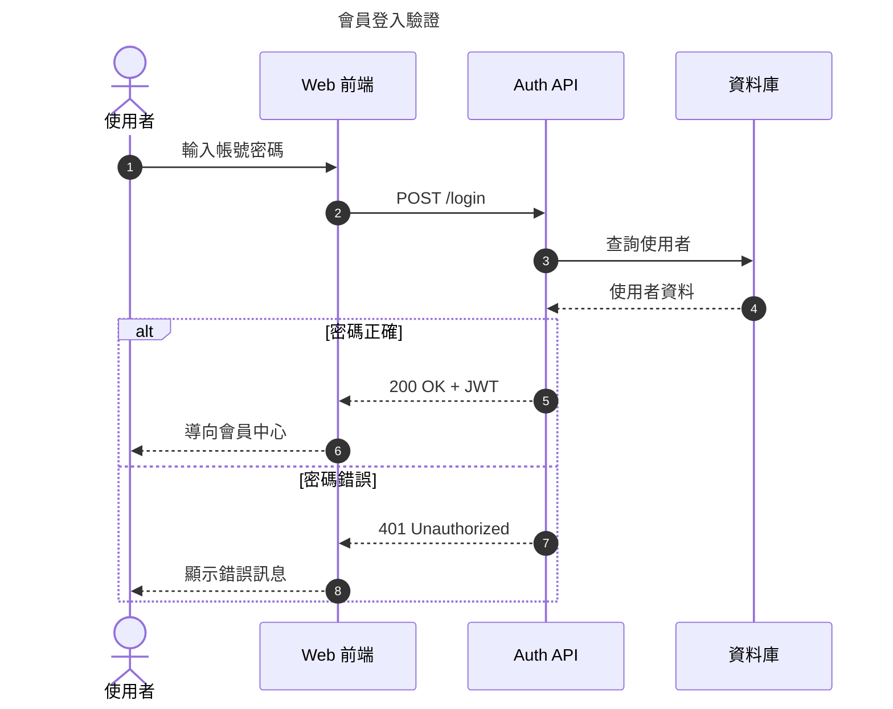
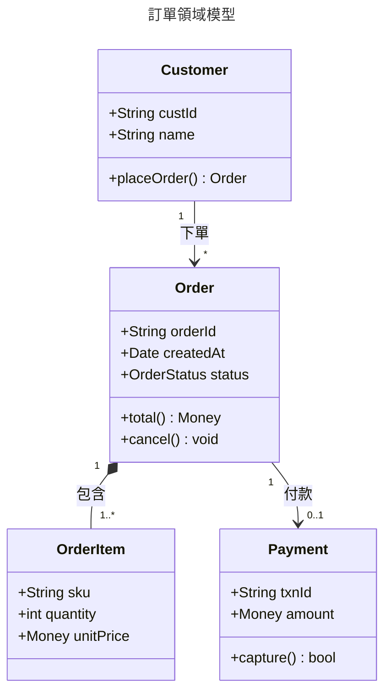
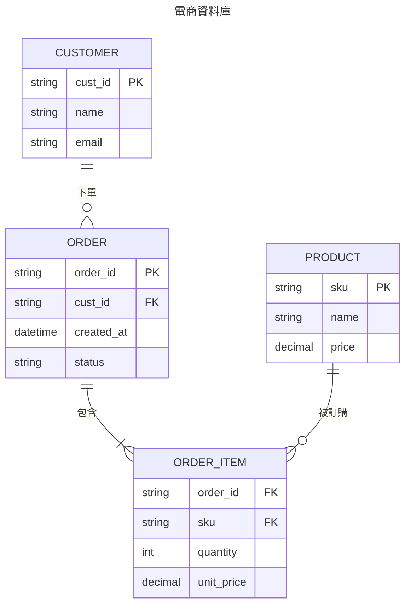
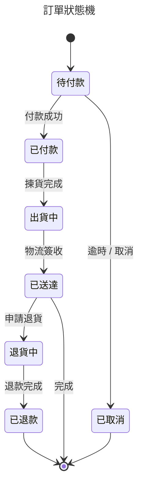
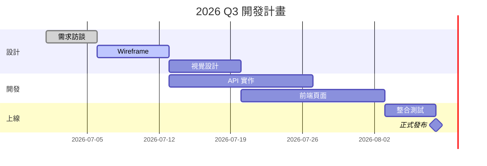
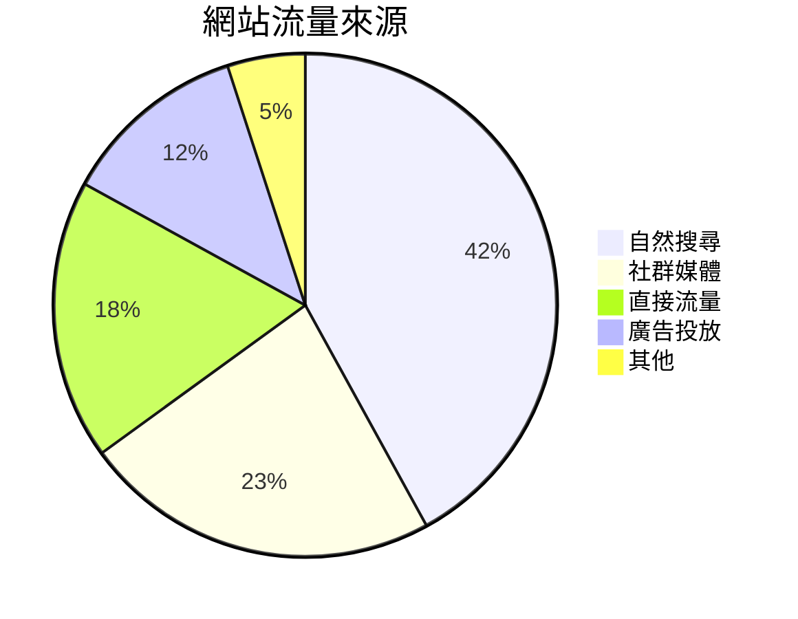
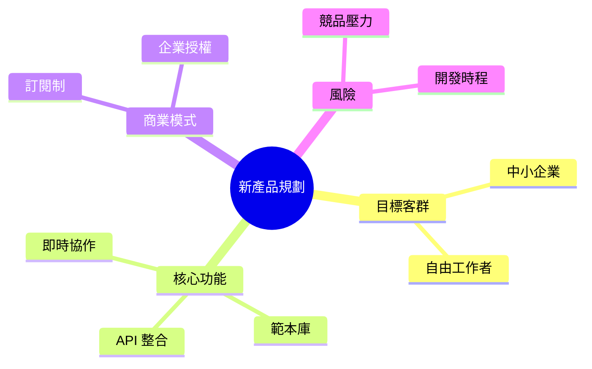
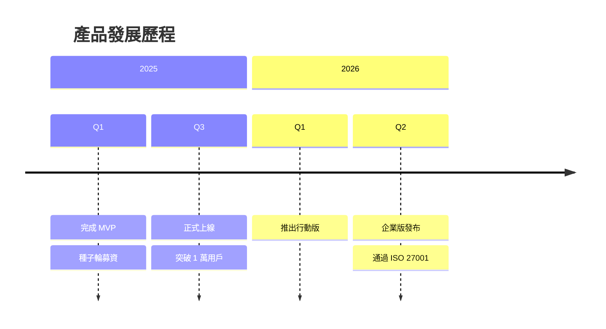

# Super Mermaid 圖表展示

開啟本檔案後，點編輯器右上角的 **preview 圖示**（或右鍵 → Super Mermaid: Open Preview to the Side），
用工具列下拉選單或按 `g` 開 Gallery 縮圖牆瀏覽全部圖表。所有圖表都是**零設定自動上色**——
沒有寫任何一行 `classDef` / `style`。

## 流程圖 Flowchart

## 循序圖 Sequence

## 類別圖 Class

## 實體關聯圖 ER

## 狀態圖 State

## 甘特圖 Gantt

## 圓餅圖 Pie

## 心智圖 Mindmap

## 時間軸 Timeline

